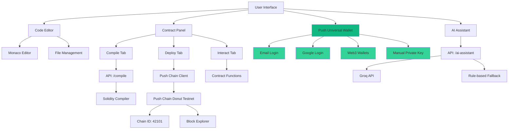
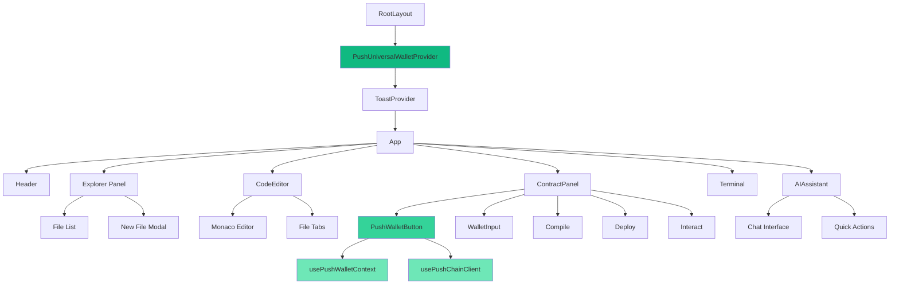
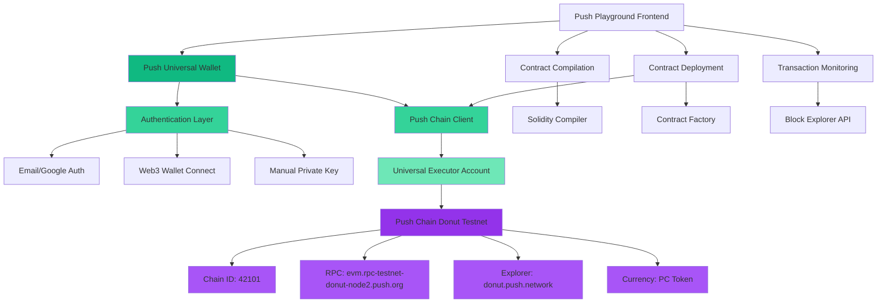
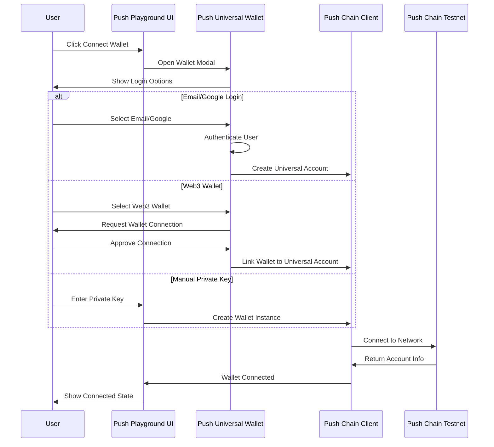
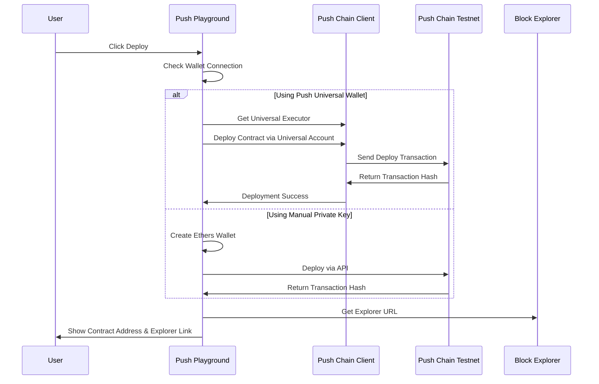

# Push Playground Architecture

## System Overview

## Component Structure

## Technology Stack

- **Frontend**: Next.js 14, React 18, TypeScript
- **Editor**: Monaco Editor (VS Code engine)
- **Styling**: Tailwind CSS
- **Wallet**: Push Universal Wallet (@pushchain/ui-kit)
- **Blockchain**: Push Chain Donut Testnet (EVM-compatible)
- **Web3**: Ethers.js v6, Push Chain Client
- **AI**: Groq API with Llama 3.1
- **Deployment**: Vercel

## Push Chain Integration

## Wallet Authentication Flow

## Deployment Flow with Push Universal Wallet

