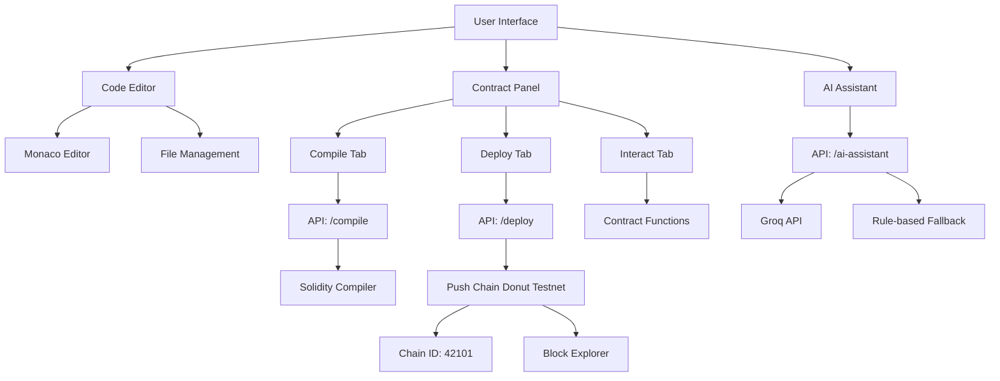
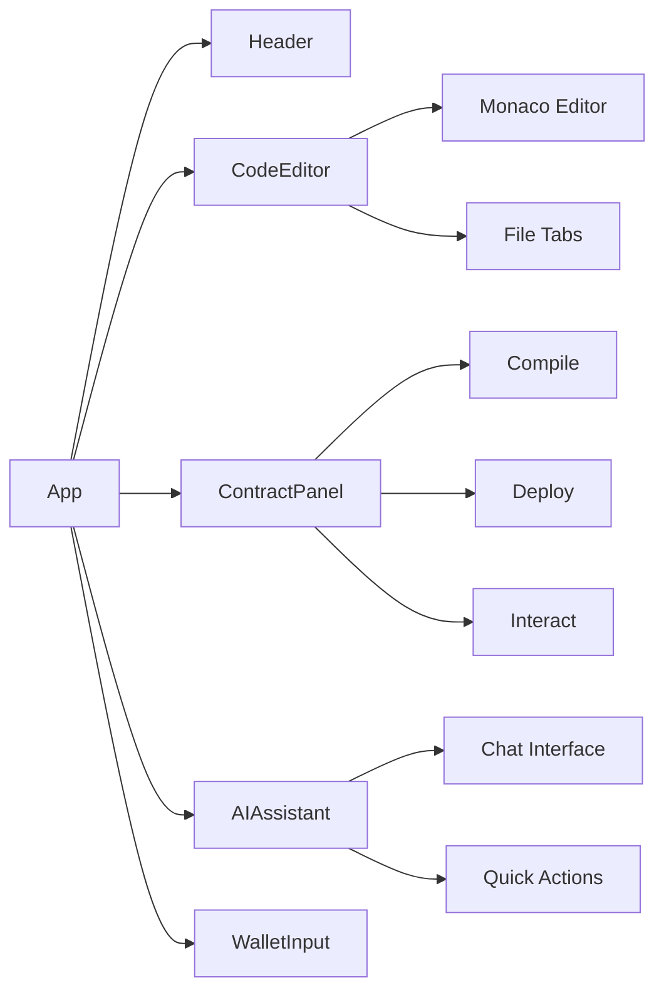
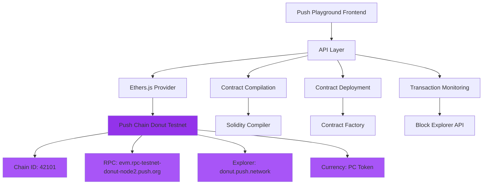

# Push Playground Architecture

## System Overview

## Component Structure

## Technology Stack

- **Frontend**: Next.js 14, React, TypeScript
- **Editor**: Monaco Editor (VS Code engine)
- **Styling**: Tailwind CSS
- **Blockchain**: Push Chain Donut Testnet (EVM-compatible)
- **AI**: Groq API with Llama 3.1
- **Deployment**: Vercel

## Push Chain Integration

