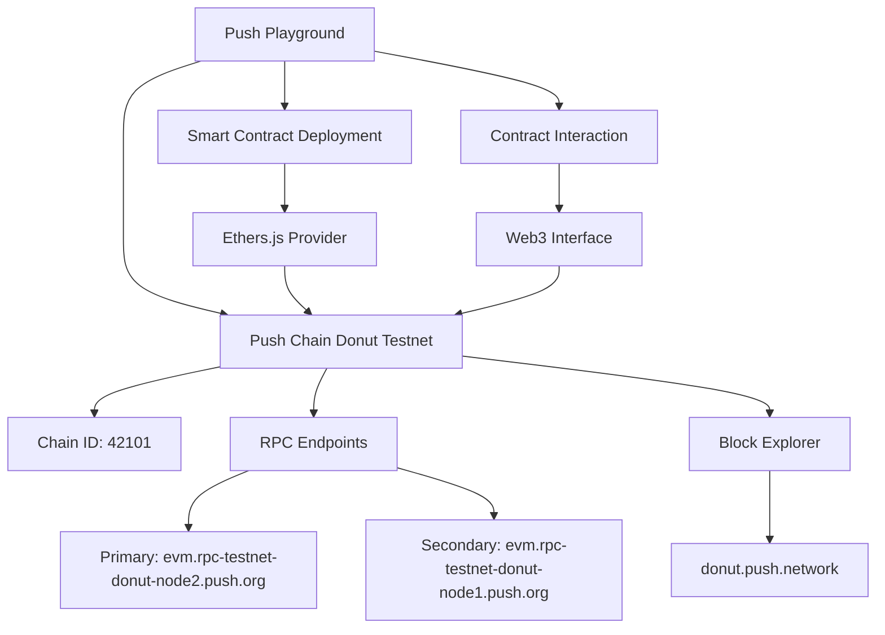
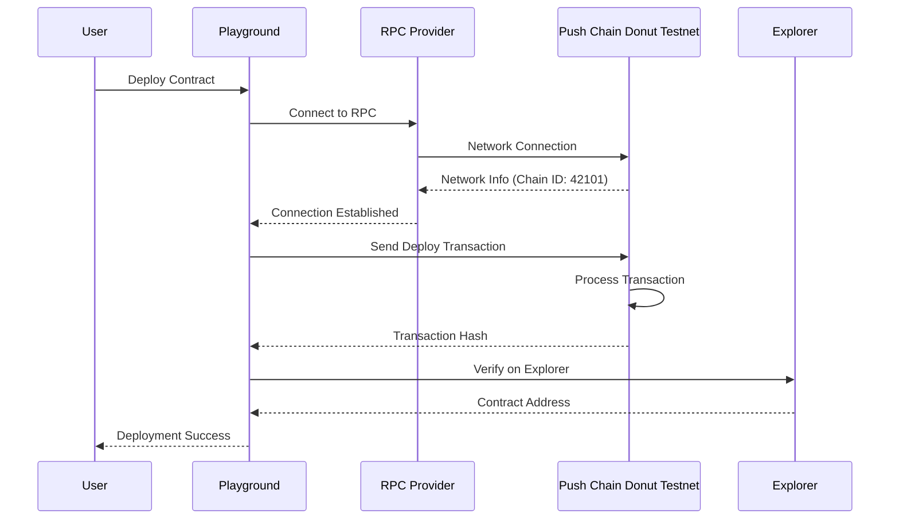
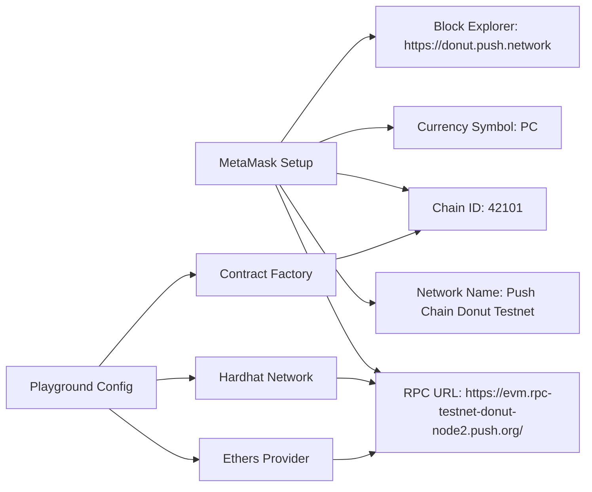

# Push Chain Donut Testnet Integration

## Network Architecture

## Deployment Flow

## Network Configuration

## Token Economics

- **Native Token**: PC (Push Chain)
- **Gas Token**: PC
- **Decimals**: 18
- **Network Type**: EVM-Compatible Testnet

## Key Features

- ✅ EVM Compatibility
- ✅ Solidity Smart Contracts
- ✅ Web3 Integration
- ✅ Block Explorer
- ✅ Testnet Faucet
- ✅ Fast Block Times
- ✅ Low Gas Fees